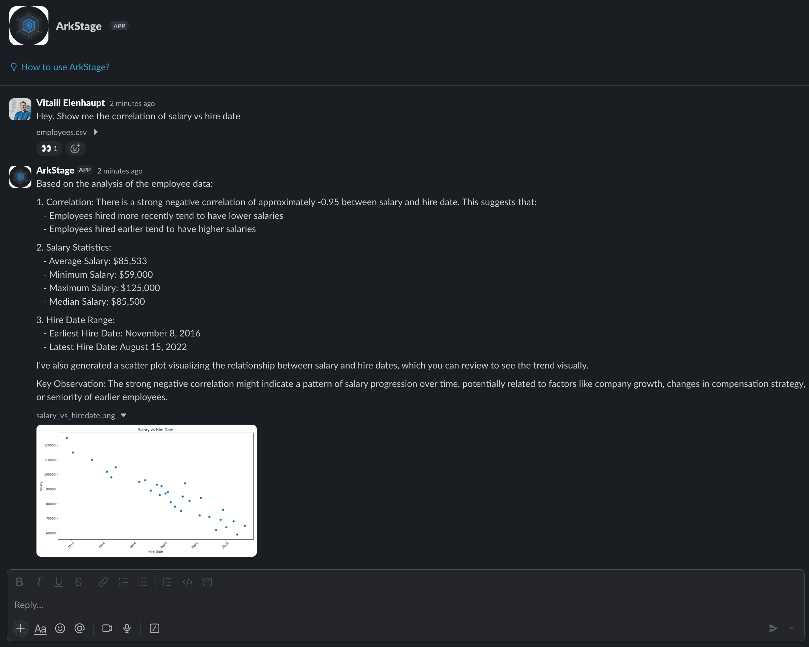

# Ark

A lightweight, high-performance Slack gateway for AWS Bedrock Agents. Single static binary, under 20 MB memory, connects via Socket Mode (no public endpoint needed).

- **Direct messages** - the bot responds in a flat conversation
- **Channel mentions** - the bot responds in a thread

Slack thread timestamps are used as Bedrock session IDs, so follow-up messages in the same thread maintain conversation context.
When a Bedrock session expires (1h idle), Ark automatically restores context from the Slack thread history.



## Why Ark?

AWS Bedrock Agents are powerful, you can wire them up to knowledge bases, action groups, and external APIs to build an assistant tailored to your organization.
But there's no built-in way to put that agent in front of your team. Ark bridges that gap: point it at your Bedrock Agent and every Slack user gets instant access.

You configure the Bedrock Agent to fit your needs, Ark handles the rest. A few examples of what teams build:

- **Engineering assistant** - connect a GitHub action group so developers can search issues, look up PRs, or get summaries of recent changes right from Slack
- **Support & project management** - attach Jira and Confluence knowledge bases so anyone can ask about ticket status, sprint progress, or find a runbook without leaving the conversation
- **Policy & compliance helper** - upload internal policy documents, employee handbooks, or security guidelines to a knowledge base and let the agent answer questions with cited sources
- **Data analyst** - hook up action groups that query your data warehouse so the team can ask plain-language questions and get tables or charts back as files
- **Onboarding buddy** - combine HR documents, engineering wikis, and org charts into a single agent that helps new hires find answers during their first weeks

The Bedrock Agent defines *what* the assistant can do. Ark makes it available *where* your team already works - in Slack, with threads, files, and formatting that feel native.

## Features

- **Conversation context** - thread timestamps map to Bedrock session IDs; when a session expires (1h idle), context is automatically restored from Slack thread history
- **File support** - upload up to 5 files per message (CSV, PDF, Excel, Word, JSON, YAML, HTML, Markdown, plain text, PNG); agent-generated files are posted back to the thread
- **Rich formatting** - markdown tables rendered as Block Kit tables, headings/bold/links converted to Slack mrkdwn, long responses split at paragraph boundaries
- **Citations** - knowledge base source documents formatted as bulleted reference lists
- **User context** - injects user name, timezone, title, and current datetime into every agent invocation
- **Concurrency control** - up to 10 parallel agent invocations with graceful "server busy" fallback
- **Rate limit handling** - automatic retry with exponential backoff for Slack API throttling
- **Analytics** - optional Kinesis Firehose stream for structured trace events (KB queries, action groups, sources) without logging conversation text
- **Security** - mention/broadcast injection prevention, HTTPS-only file downloads, SigV4 request signing
- **Flexible credentials** - auto-resolves AWS credentials from environment variables, ECS task role, or AWS CLI (SSO, assume-role, instance profile)
- **Minimal footprint** - single static binary, under 20 MB memory, near-zero idle CPU

## Prerequisites

- A Slack app with Socket Mode enabled and scopes: `app_mentions:read`, `channels:history`, `chat:write`, `files:read`, `files:write`, `im:history`, `reactions:write`, `users:read`
- An AWS Bedrock Agent with an alias

## Configuration

All configuration is via environment variables:

| Variable | Required | Description |
|---|---|---|
| `SLACK_BOT_TOKEN` | yes | Slack bot user OAuth token (`xoxb-...`) |
| `SLACK_APP_TOKEN` | yes | Slack app-level token for Socket Mode (`xapp-...`) |
| `BEDROCK_AGENT_ID` | yes | AWS Bedrock Agent ID |
| `BEDROCK_AGENT_ALIAS_ID` | yes | AWS Bedrock Agent Alias ID |
| `AWS_PROFILE` | no | AWS profile name (supports SSO, assume-role) |
| `AWS_ACCESS_KEY_ID` | no | AWS access key |
| `AWS_SECRET_ACCESS_KEY` | no | AWS secret key |
| `AWS_SESSION_TOKEN` | no | AWS session token (for temporary credentials) |
| `AWS_REGION` | no | AWS region (default: `us-east-1`, or from profile config) |
| `FIREHOSE_STREAM_NAME` | no | Kinesis Firehose stream for analytics (enables Bedrock tracing) |
| `SESSION_TTL_MINUTES` | no | Session staleness threshold in minutes (default: `55`, range: 1-60) |
| `LOG_LEVEL` | no | Log level: `debug`, `info`, `warn`, `error` (default: `info`) |

AWS credentials are resolved automatically: explicit keys > ECS task role > AWS CLI (SSO, assume-role, instance profile).

## Development

```sh
cp .env.example .env  # fill in your values
make build            # debug binary
make test             # run specs
make lint             # run ameba
make format           # format source
```

Environment variables in your shell take precedence over `.env` values.

## Docker

```sh
docker build -t ark .
docker run -e SLACK_BOT_TOKEN=... -e SLACK_APP_TOKEN=... \
  -e BEDROCK_AGENT_ID=... -e BEDROCK_AGENT_ALIAS_ID=... \
  ark
```

The image uses a multi-stage build (Crystal Alpine -> Alpine) with a static binary. Ark uses under 20 MB of memory and near-zero CPU at idle — it runs comfortably on the smallest instances (e.g., `t4g.nano`).

## Documentation

Full documentation is available at [crystal-autobot.github.io/ark](https://crystal-autobot.github.io/ark).
