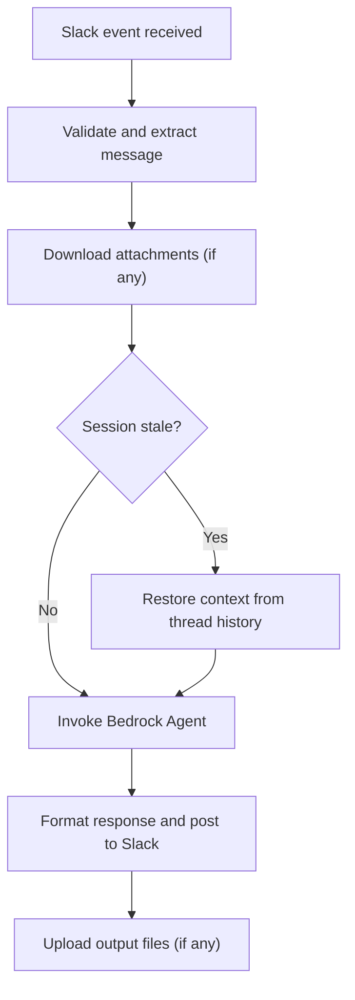
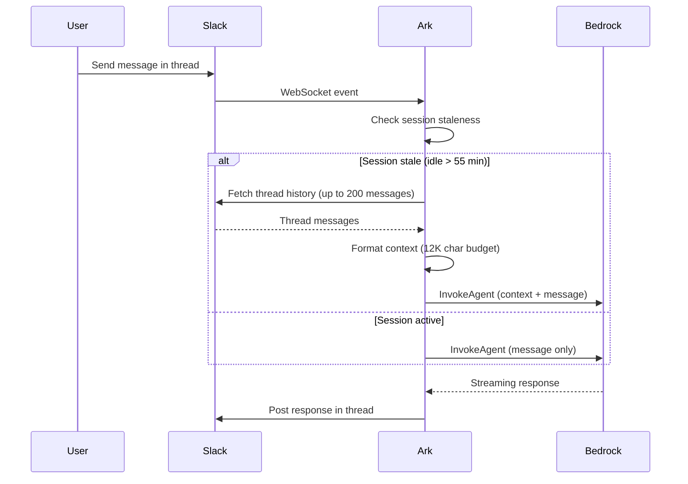

# Message flow

This page traces a message from Slack through Ark and back.

## Direct message flow

## Channel mention flow

The mention flow is similar with two differences:

1. The `<@BOT_ID>` mention is stripped from the text before forwarding
2. The response is always posted in a thread (using the message timestamp)

## Session management

Bedrock sessions are mapped to Slack threads:

| Slack context | Session ID |
|---|---|
| DM — first message | Message timestamp (e.g., `1710412200-123456`) |
| DM — thread reply | Thread timestamp |
| Channel — first mention | Message timestamp |
| Channel — thread reply | Thread timestamp |

The dot in Slack timestamps (e.g., `1710412200.123456`) is replaced with a dash for Bedrock compatibility.

### Thread context restoration

Bedrock Agent sessions have a maximum idle TTL of 1 hour. When a user resumes a thread after the session expires, the agent loses all conversation memory. Ark detects this and automatically restores context:

1. **Staleness check** — the gateway tracks the last successful invocation per session. If the session is unknown (e.g., after restart) or idle longer than the TTL (default 55 minutes), it is considered stale.
2. **Thread fetch** — Slack's `conversations.replies` API retrieves up to 200 messages from the thread.
3. **Formatting** — messages are formatted as `User (name): text` / `Assistant: text`, newest-first within a 12,000 character budget. Error replies and non-standard subtypes are filtered out. Long messages are truncated to 2,000 characters.
4. **Injection** — the formatted context is prepended to `inputText` (not `promptSessionAttributes`), so it only costs tokens on the first message after expiry.
5. **Graceful fallback** — if the thread fetch fails, the message proceeds without context.

The TTL is configurable via `SESSION_TTL_MINUTES` (default: 55).

## User context

Each message includes user attributes in the Bedrock session state:

| Attribute | Source |
|---|---|
| `current_datetime` | UTC ISO 8601 timestamp |
| `user_name` | Slack user's real name |
| `user_timezone` | Slack user's timezone |
| `user_title` | Slack user's profile title |

User info is cached per user ID for the lifetime of the process.

## File handling

### Input files (Slack to Bedrock)

- Max 5 files per message
- Max 10 MB per file
- MIME type resolved from Slack metadata, with extension-based fallback
- Sent to Bedrock as `CODE_INTERPRETER` use case with base64-encoded content
- Supported types: CSV, Excel, JSON, YAML, Word, HTML, Markdown, TXT, PDF, PNG

### Output files (Bedrock to Slack)

- Files returned by the agent (e.g., code interpreter output) are uploaded to the same Slack thread
- Uses `files.uploadV2` (get upload URL, upload content, complete)
