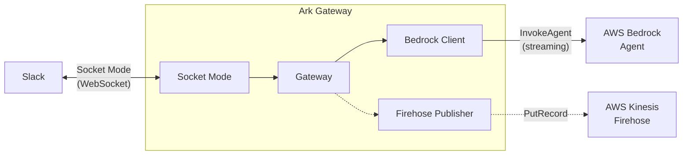

# Architecture overview

Ark is structured as a gateway that bridges two systems: Slack (via Socket Mode WebSocket) and AWS Bedrock (via the InvokeAgent streaming API).

## Component diagram

## Key modules

### `Ark::Gateway`
The central orchestrator. Receives events from Socket Mode, routes them to the appropriate handler, invokes the Bedrock agent, and posts responses back to Slack.

### `Ark::Slack::SocketMode`
Manages the WebSocket lifecycle: calls `apps.connections.open` to get a WSS URL, connects, handles reconnection with backoff, and acknowledges envelopes.

### `Ark::Slack::Client`
Wraps the Slack Web API: `auth.test`, `chat.postMessage`, `reactions.add`, `users.info`, `conversations.replies`, and `files.uploadV2`.

### `Ark::Slack::ThreadContext`
Formats Slack thread history into a character-budgeted context string for injection into Bedrock when a session has expired.

### `Ark::Slack::Mrkdwn`
Converts markdown from Bedrock responses to Slack's mrkdwn format (bold, strikethrough, links, headings).

### `Ark::Slack::BlockKit`
Detects markdown tables in responses and renders them as Slack Block Kit table blocks.

### `Ark::Bedrock::Agent`
Builds and signs HTTP requests to the Bedrock Agent Runtime `InvokeAgent` API, sends them, and parses the streaming event stream response.

### `Ark::Bedrock::EventStream`
Decodes AWS's binary event stream protocol (`application/vnd.amazon.eventstream`). Each frame contains headers and a payload — the decoder extracts text chunks, citations, output files, and trace events.

### `Ark::Bedrock::TraceParser`
Extracts structured metadata from Bedrock Agent trace events: preprocessing rationale, knowledge base IDs, search queries, action groups, and source documents from KB observations. Only active when analytics is enabled.

### `Ark::AWS::Signer`
Wraps the `awscr-signer` library for SigV4 request signing.

### `Ark::AWS::Credentials`
Resolves AWS credentials from explicit environment variables or `~/.aws/credentials` profiles.

### `Ark::AWS::FirehosePublisher`
Publishes structured analytics events to Kinesis Firehose as newline-delimited JSON via signed `PutRecord` requests. Events contain trace metadata (knowledge bases, search queries, rationale) rather than raw conversation text.

## Design decisions

### No public endpoint
Socket Mode uses an outbound WebSocket connection, so Ark needs no ingress, load balancer, or public IP.

### Abstract classes for testability
Key dependencies (`AgentInvoker`, `SlackAPI`, `EventPublisher`) are abstract classes. The Gateway accepts them via constructor injection, making all business logic testable with mocks.

### Single-threaded fibers
Crystal uses cooperative fibers, not OS threads. The gateway runs the event loop in one fiber and spawns lightweight fibers for fire-and-forget operations (reactions, analytics publishing).

### Direct HTTP over AWS SDK
Crystal has no official AWS SDK. Ark uses `awscr-signer` for SigV4 and makes direct HTTP calls to AWS APIs, which keeps dependencies minimal and the binary small.
