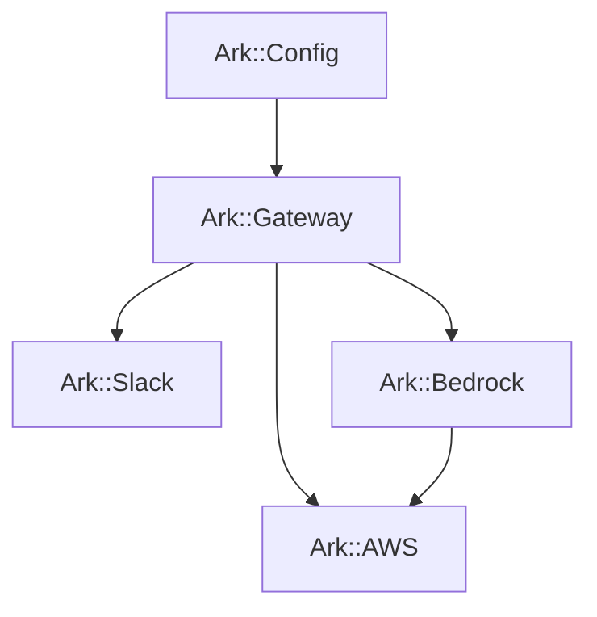

# Project structure

## Module overview

The codebase is organized into four main modules under `src/ark/`:

- **`Ark::Gateway`** — the central orchestrator that ties everything together. Handles the event loop, routes messages and mentions, invokes the agent, and posts responses.

- **`Ark::Slack`** — everything Slack-related: Socket Mode WebSocket connection, Web API client (messages, reactions, files, users), markdown-to-mrkdwn conversion, and Block Kit table rendering.

- **`Ark::Bedrock`** — everything Bedrock-related: the Agent Runtime client with SigV4-signed requests, streaming response parsing via the AWS binary event stream protocol, trace metadata extraction, session management, and file handling.

- **`Ark::AWS`** — shared AWS infrastructure: credential resolution (explicit keys or `~/.aws` profile), SigV4 signing, and the optional Firehose analytics publisher.

Configuration lives in `Ark::Config`, which loads environment variables with `.env` file support.

Specs mirror the source structure under `spec/ark/` and use mock implementations for all external dependencies, making the full message flow testable without network calls.
